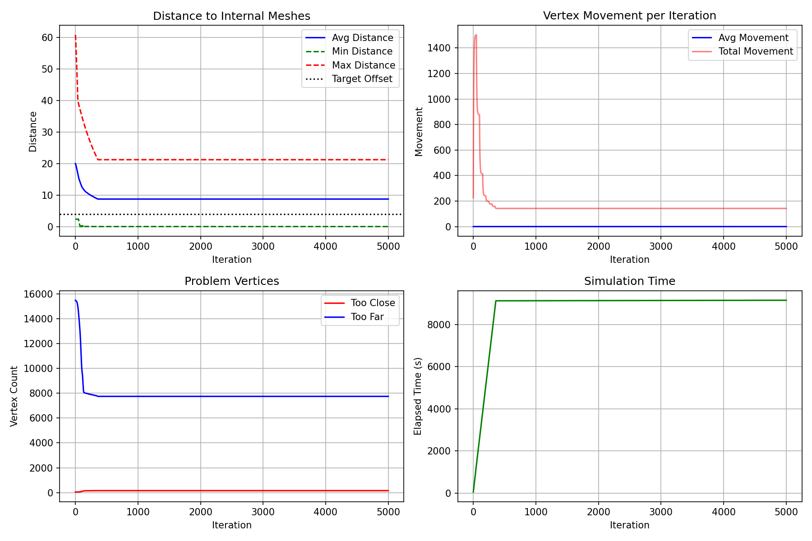

# 🧬 Skin-to-Muscle Registration

**Skin-to-Muscle Registration** is an undergraduate research project at **Simon Fraser University** investigating the automation of skin mesh registration for biomechanical facial models, and the automatic detection, correction and fairing of the artifacts that registration leaves behind.

The project aims to replace the manual "shrink-wrap" process currently required to fit a generic epidermal skin mesh onto customized facial musculature. By combining geometry processing techniques with physically-inspired constraints inside Autodesk Maya, the goal is to produce an automated registration and cleanup pipeline that significantly reduces artist effort while preserving anatomical accuracy.

The code on the `feature/m5-final-artifact-detection` branch is the final research state of the project: target-based registration, five artifact detectors (M1 to M5), an exact skin-anatomy intersection detector, and the correction and smoothing stages built on top of them.

---

# 🎯 Research Overview

Preparing biomechanical facial models currently requires artists to manually adjust and register an epidermal skin mesh around a personalized arrangement of muscles, bones and fat compartments.

This manual workflow is:

- Time-consuming
- Difficult to reproduce
- Dependent on expert knowledge
- Hard to scale for multiple characters

This project investigates whether this process can instead be performed automatically using computational geometry and optimization methods.

Even after a good registration, the skin mesh can still carry two kinds of defects:

- **Sharp or broad geometric artifacts** such as bumps, ridges and faceted patches
- **Closed-skin anatomy protrusion**, where fat or muscle crosses the skin surface in a region that should stay covered (the eye and mouth openings are valid exposure and are never treated as defects)

The final goal is a pipeline that can automatically transform a generic facial skin mesh into a registered, artifact-free skin suitable for biomechanical facial simulation.

The central finding of the cleanup research: a deliberately unconstrained **pure Laplacian** run showed that the surface can be made smooth almost immediately, so the anatomical safety constraint belongs in a **local freeze** (the blocked Laplacian) rather than in a global weakening of the smoother.

---

# 🖼 Pipeline Overview

Example flow:

```
Generic Skin Mesh
        │
        ▼
Target Generation
        │
        ▼
Shrink-Wrap Registration
        │
        ▼
Collision Handling
        │
        ▼
Landmark Constraints
        │
        ▼
Registered Skin Mesh
        │
        ▼
Artifact Detection (M1 to M5)
        │
        ▼
Skin-Anatomy Intersection Check
        │
        ▼
Unified Cleanup Solver
        │
        ▼
Blocked Laplacian Smoothing
        │
        ▼
Micro-Clearance Push
        │
        ▼
Final Skin Mesh
```

---

# ✨ Current Features

Current implementation includes:

- Target-based shrink-wrap registration
- Collision-aware mesh deformation
- Soft-minimum unsigned distance field (SDF) collision handling
- Anatomical landmark constraints
- Lip, eye and nose contour preservation
- Vertex neighborhood smoothing
- Automatic convergence monitoring and periodic auto-save
- Five artifact detectors: umbrella Laplacian (M1), reference-based Laplacian (M2), multi-scale and hybrid (M3), SDF-referenced (M4) and the unified M3 + M4 detector (M5)
- Exact triangle-triangle skin-anatomy intersection detector (eye and mouth openings excluded)
- Intersection repair, constrained smoothing and a unified per-vertex cleanup solver
- Pure Laplacian, blocked Laplacian and micro-clearance push stages
- Cleanup reports, displacement statistics and CSV/JSON run logs
- Offline test suite that runs without Maya
- Visualization of registration progress

---

# ✅ Project Status

- Detection (M1 to M5) is complete and frozen at M5
- The unified cleanup solver removes all 93 forbidden intersecting faces of the registered skin, but plateaus in smoothness
- The blocked Laplacian keeps most of the pure Laplacian smoothing with no forbidden faces in an offline reproduction on the saved scene
- The saved final scene (`t34.mb`) is a **hybrid** result: pure Laplacian smoothing followed by about 130 documented manual vertex edits, leaving 3 residual forbidden faces at the chin and jaw
- This is a research result on one character, not yet a general fully automatic production system

---

# 📊 Registration Progress



```
assets/figures/simulation_plot.png
```

The recorded registration run stores metrics for every iteration, allowing convergence analysis and comparison between different parameter settings. In this run, the distance to the internal meshes and the vertex movement flatten after roughly the first 400 iterations.

---

# 📈 Evaluation Metrics

The recorded registration run (`assets/metrics/simulation_metrics.csv`) logs at every iteration:

- Average, minimum and maximum distance to the internal meshes
- Average and total vertex movement
- Number of vertices that are too close or too far
- Iteration count
- Runtime statistics

The committed registration script also prints progress (average movement, average SDF distance, settled and penetrating vertices) to the Script Editor while it runs.

The cleanup stage never changes the mesh topology (15,905 vertices and 15,636 faces for the research skin), so every saved state can be compared vertex by vertex. It is evaluated with:

- **Forbidden intersecting faces:** exact triangle-triangle skin-anatomy test (the safety metric)
- **Roughness:** umbrella-Laplacian norm per vertex (mean, 95th and 99th percentile, maximum)
- **Fidelity:** vertex displacement, point-to-surface and Hausdorff distance between states
- **Mesh quality:** face angles, edge-length variation, adjacent-face normal angles
- **Clearance:** unsigned distance from each vertex to the nearest anatomy triangle

Results on the saved Maya scene, pre-cleanup skin to saved final mesh (world units, mean edge length about 2.5):

- Forbidden intersecting faces: 93 to 3 (0 after the unified solver)
- All-vertex mean roughness: 0.1345 to 0.0965 (28% lower)
- 95th percentile roughness: 0.403 to 0.231 (43% lower)
- 99th percentile roughness: 0.681 to 0.402 (41% lower)
- Surface fidelity: mean point-to-surface distance of 0.043 units between the clean baseline and the final mesh
- Blocked Laplacian (offline reproduction): 0 forbidden faces with 342 frozen vertices (3.8% of the smoothed set), keeping about 92% of the roughness reduction of the pure Laplacian in the rough core (the pure Laplacian itself creates 143 forbidden faces)

Full derivations, tables and figures are in the final research report.

---

# 🧱 Repository Structure

```
skin-to-muscle-registration/
│
├── README.md
├── LICENSE
├── requirements.txt
├── .gitignore
│
├── src/
│   ├── d98-target_shrinkwrap_registration.py
│   ├── artifact_detection.py
│   ├── anatomy_constraint.py
│   ├── smoothing_utils.py
│   ├── final_cleanup_solver.py
│   ├── pure_laplacian_smoothing.py
│   ├── blocked_laplacian_smoothing.py
│   ├── micro_clearance_push.py
│   ├── cleanup_pipeline.py
│   ├── mesh_utils.py
│   ├── region_selection.py
│   ├── metrics_utils.py
│   └── maya_io.py
│
├── src/
│   ├── Executive_Summary.pdf
│   └── Skin_to_Muscle_Registration_Final_Report.pdf
│
├── .cs_test/
│   └── test_*.py
│
├── assets/
│   ├── figures/
│   └── metrics/
│
└── maya/
    └── README.md
```

Key modules:

- `d98-target_shrinkwrap_registration.py`: registration, plus the wrapper functions you call from Maya for every cleanup stage (the only file you send to Maya)
- `artifact_detection.py`: detectors M1 to M5 and the SDF reference
- `anatomy_constraint.py`: exact closest-anatomy queries, the intersection detector and the repair routines
- `final_cleanup_solver.py`: unified detect, fair and repair solver
- `pure_laplacian_smoothing.py`, `blocked_laplacian_smoothing.py`, `micro_clearance_push.py`: the final smoothing and finishing stages
- `cleanup_pipeline.py`: the earlier iterative detect, smooth, re-detect loop (kept for comparison)

Maya scene files (`*.mb`), `cleanup_logs/`, `paper/` and `Useful Notes/` are ignored by Git. Obtain the scenes from the project lab storage (see `maya/README.md`).

---

# ⚙️ Current Workflow

The whole pipeline is currently implemented inside **Autodesk Maya** using the Maya Python API.

Typical workflow:

```python
exec(open("src/d98-target_shrinkwrap_registration.py").read())

# Registration
setup_target_registration()

apply_all_contour_landmarks()

run_shrinkwrap(1600)

# Cleanup
backup_skin_mesh()

result = run_final_skin_cleanup(max_iterations=200)

run_blocked_skin_smoothing()

run_micro_clearance_push()
```

The pipeline performs:

1. Load the skin mesh
2. Load the target mesh
3. Build the Signed Distance Field (SDF) from the anatomy meshes
4. Detect anatomical landmarks
5. Run iterative shrink-wrap optimization
6. Preserve important facial contours
7. Record convergence statistics
8. Back up the registered skin and detect residual artifacts (M1 to M5)
9. Measure skin-anatomy intersections with the exact triangle-triangle detector
10. Remove intersections and fair the surface with the unified cleanup solver
11. Smooth the remaining rough regions with the blocked Laplacian
12. Push the last few near-anatomy faces outward with the micro-clearance push
13. Re-check intersections and save the result as a new scene

See **Running the Full Pipeline** below for the exact commands and their options.

---

# 🧰 Setup

Requirements:

- Autodesk Maya with Python 3 (the scripts use `maya.cmds` and `maya.api.OpenMaya`, which ship with Maya)
- A Maya scene that contains the skin mesh, the scaled-down target mesh and the anatomy meshes (not stored in Git)
- Optional: `matplotlib` for plots (without it everything still runs and plotting is disabled)

### 1. Get the code

```bash
git clone https://github.com/florykhan/skin-to-muscle-registration.git
cd skin-to-muscle-registration
git checkout feature/m5-final-artifact-detection
```

### 2. Optional: install matplotlib into Maya's Python

```bash
mayapy -m pip install -r requirements.txt
```

### 3. Tell the script where `src/` lives

Maya (and the VS Code MayaCode extension) does not run the script from its real location, so the helper modules must be found explicitly. Use either option:

- Edit `HELPER_SRC_DIR` near the top of `src/d98-target_shrinkwrap_registration.py`, or
- Set the `SMR_SRC_DIR` environment variable before starting Maya, for example in `userSetup.py`:

```python
import os
os.environ["SMR_SRC_DIR"] = "/path/to/skin-to-muscle-registration/src"
```

Also check the machine-specific paths in the same file: `VERTEX_PRESETS_FOLDER` (contour landmark presets) and the base folder inside `auto_save_scene()` (registration checkpoints).

### 4. Prepare the scene

Open the scene in Maya. The script expects these node names (edit `SKIN_MESH`, `TARGET_MESH` and `INTERNAL_MESHES` near the top of the file if your scene differs):

- Skin mesh: `skin_cloth_copy_v5_pull_back`
- Target mesh: `skin_cloth_copy_v5_pull_back_target` (a scaled-down copy of the skin)
- Anatomy meshes: the muscles, bone and fat listed in `INTERNAL_MESHES`

Scenes used in the research: `s37 repaired the lower lip not match issue.mb` (registration start), `t32 ... 1600 iterations ... .mb` (converged registration) and `t34.mb` (final cleaned state).

### 5. Load the script in Maya

In the Script Editor (Python tab):

```python
exec(open(r"/path/to/skin-to-muscle-registration/src/d98-target_shrinkwrap_registration.py").read())
```

Or use the VS Code MayaCode extension: open the command port once in Maya (MEL tab), then send the file from VS Code:

```
commandPort -name "localhost:7001" -sourceType "mel";
```

If you edit a helper module, send or `exec` the main script again to reload the helpers.

---

# ▶️ Running the Full Pipeline

Every cleanup function accepts `apply=False` for a dry run that leaves the scene untouched. Each stage that changes the mesh first duplicates it as a backup node (`_precleanup`, `_precleanupsolver`, `_pre_blocked_laplacian`, `_pre_micro_clearance_push`); use `restore_skin_from_backup("<backup node name>")` to roll back.

### Step 1: Registration

Start from the registration scene, then:

```python
setup_target_registration()

apply_all_contour_landmarks()

run_shrinkwrap(1600)
```

The run saves a checkpoint every 200 iterations and stops early once the average vertex movement converges. To continue a run, call the same three commands again. The recorded research run chose iteration 1600 as the converged result.

### Step 2: Back up and inspect the registered skin

```python
backup_skin_mesh()

summarize_skin_anatomy_distances()
```

`summarize_skin_anatomy_distances()` is read-only and reports the skin-to-anatomy distance distribution; its median is a sensible `target_offset` for the SDF-based detectors below.

### Step 3: Detect artifacts (detection only, nothing moves)

```python
detect_skin_artifacts(percentile=97.5)                              # M1 umbrella Laplacian
detect_reference_skin_artifacts()                                   # M2 reference-based (uses the target mesh)
detect_multiscale_skin_artifacts(scales=(1, 2, 3))                  # M3 V1 multi-scale
detect_hybrid_skin_artifacts()                                      # M3 V2 hybrid
detect_sdf_reference_skin_artifacts(target_offset=7.3998)           # M4 SDF reference

indices, report = detect_m5_skin_artifacts(target_offset=7.3998)    # M5 unified detector
```

`7.3998` is the value used for the research scene; use your own scene's observed median. The flagged vertices are selected in the viewport (yellow dots).

### Step 4: Measure the safety metric

```python
report = analyze_m5_region_intersections(indices=None, select_faces=True)
```

This scans the whole skin with the exact triangle-triangle detector, selects the offending skin faces and never moves a vertex. Eye and mouth openings are excluded. The registered research scene has 93 forbidden faces by the offline detector.

### Step 5: Automated cleanup (unified solver)

```python
result = run_final_skin_cleanup(
    skin_mesh="skin_cloth_copy_v5_pull_back",
    max_iterations=200,
    apply=True,
)

print_final_cleanup_report(result)
```

This detects, fairs, projects away from anatomy and repairs in one call. On the research scene it removed all 93 forbidden faces.

### Step 6: Blocked Laplacian smoothing

```python
blocked = run_blocked_skin_smoothing(
    skin_mesh="skin_cloth_copy_v5_pull_back",
    roughness_percentile=75,
    growth_rings=2,
    strength=0.35,
    iterations=10,
    freeze_rings=1,
    apply=True,
)

print_blocked_laplacian_report(blocked)
```

Run this on the intersection-free mesh from Step 5: it needs a valid starting state. Whenever a proposed step would create a real anatomy crossing, that region is rolled back and frozen for the rest of the run.

Optional diagnostic: `run_pure_skin_smoothing(...)` runs the same smoothing with no safety at all. It smooths fastest but creates forbidden faces, and it exists to show that the operator is not the limiting factor.

### Step 7: Micro-clearance push

```python
micro = run_micro_clearance_push(
    skin_mesh="skin_cloth_copy_v5_pull_back",
    target_clearance=0.15,
    blend_rings=1,
    apply=True,
)

print_micro_clearance_report(micro)
```

A one-shot local outward push on the few faces that are still forbidden. It is not another smoothing pass.

### Step 8: Verify and save

```python
analyze_m5_region_intersections(indices=None, select_faces=True)

save_cleanup_scene(r"/path/to/t35_cleanup.mb")
```

`save_cleanup_scene()` writes a new `.mb` file and refuses to overwrite an existing one unless `force=True`.

### Localized manual cleanup

For a single bad patch, select vertices in the viewport (Vertex mode) and smooth only that region:

```python
cleanup_selected_region(strength=0.3, iterations=8)

cleanup_named_region("lips", strength=0.3, iterations=8)
```

Named regions are `chin`, `lips`, `nose`, `cheeks` and `eyes`.

---

# 🧪 Running the Tests

The tests are plain Python scripts (no `pytest`, no Maya). Maya access is mocked, and the intersection detector is exercised on small synthetic anatomy. From the repository root, with Python 3.10 or newer:

```bash
for t in .cs_test/test_*.py; do python3 "$t"; done
```

Each script prints its checks and ends with an "all checks passed" line. To run one module, call it directly, for example `python3 .cs_test/test_blocked_laplacian_smoothing.py`.

---

# 🧠 Registration Algorithm

The current implementation combines several techniques:

- Target-based vertex attraction
- Soft-minimum unsigned distance field (SDF) collision detection
- Laplacian smoothing
- Edge-length preservation
- Landmark constraints
- Soft-body inspired relaxation
- Automatic convergence detection

Future work will investigate additional registration methods including:

- Non-Rigid ICP
- Laplacian Surface Editing
- As-Rigid-As-Possible (ARAP) deformation
- Energy-based optimization

---

# 🧹 Post-Registration Cleanup Algorithms

The cleanup stages that run after registration use:

- Umbrella-Laplacian roughness with percentile thresholding (M1), and its reference-based, multi-scale and hybrid variants (M2, M3)
- A soft-minimum distance field with damped-Newton projection onto an offset iso-surface as an anatomy-derived reference (M4), fused with M3 by set union and provenance tracking (M5)
- A Möller-style triangle-triangle intersection test that separates real surface crossing from proximity and from valid eye and mouth exposure
- Normal-push and anatomy-supported harmonic patch repair
- Global-step constrained smoothing and a unified per-vertex trust-region solver
- Taubin (lambda | mu) fairing with roughness-targeted weights
- Pure Jacobi Laplacian smoothing, used as a diagnostic
- Blocked Laplacian smoothing (rollback and local freeze on real intersection)
- A one-shot micro-clearance push

---

# 🛠 Technologies

- Python
- Autodesk Maya API
- Maya Commands (cmds)
- Maya OpenMaya API
- Computational Geometry
- Mesh Processing
- Distance Fields
- Numerical Optimization
- Matplotlib

---

# 🚀 Future Work

Planned improvements include:

- Anatomy-aware handling of the last residual regions, removing the manual finishing pass
- Running the blocked Laplacian end to end in Maya on an intersection-free baseline, with sweeps over strength and freeze rings
- Modularizing the registration pipeline
- Improved collision handling
- Faster convergence
- Better landmark correspondence
- Automatic parameter tuning
- Labelled artifacts for detector precision and recall
- Testing on multiple characters and registrations
- Quantitative comparison with manual registration
- Comparison with feature-preserving smoothers and Non-Rigid ICP approaches
- Publishable benchmark experiments

---

# 📚 Related Research

This repository accompanies undergraduate research on automated skin registration for biomechanical facial models.

Primary reference:

> **Beneath the Skin: Interactive Biomechanical Facial Simulations via Composable Co-Expressions**

The cleanup research is documented in the final research report, *Automated Detection, Correction, and Surface Fairing for Skin-to-Muscle Registration Artifacts* (September 2026).

Selected references:

- G. Taubin, "A signal processing approach to fair surface design," SIGGRAPH 1995.
- M. Desbrun, M. Meyer, P. Schröder and A. H. Barr, "Implicit fairing of irregular meshes using diffusion and curvature flow," SIGGRAPH 1999.
- T. Möller and B. Trumbore, "Fast, minimum storage ray-triangle intersection," Journal of Graphics Tools, 1997.
- J. A. Bærentzen and H. Aanæs, "Signed distance computation using the angle weighted pseudonormal," IEEE TVCG, 2005.
- O. Sorkine et al., "Laplacian surface editing," Symposium on Geometry Processing, 2004.

Additional references will be added throughout the project.

---

# 📄 License

This project is released under the MIT License.

See the `LICENSE` file for details.

---

# 👨‍💻 Author

**Ilian Khankhalaev**

Undergraduate Researcher  
Simon Fraser University

---

# 🙏 Acknowledgements

This project is conducted as part of an undergraduate research position at Simon Fraser University.

Special thanks to my research supervisor, Richard Peng, for guidance throughout the project.
